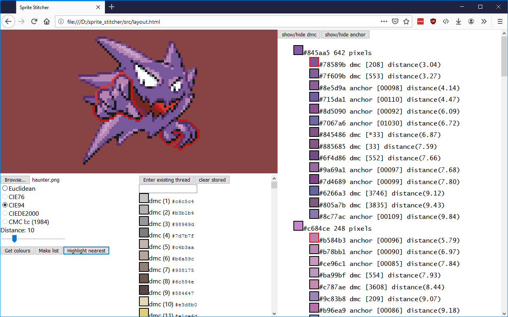

Sprite Stitcher
======
**Sprite Stitcher** is a quick tool I made to get DMC/Anchor floss colours from the RGB values of pixels, and make a list of the colours needed for your cross stitch project. Floss approximate RGB colours provided by DMC and Anchor themselves.

#### Screenshot

## Usage
Open layout.html in browser.

1) Select a small transparent png of your choice.
2) Select a colour distance algorithm. (best is CIE94 I think)
3) Click 'Get colours' to generate a floss list per pixel, ordered by 'closest' colour.
4) Click the colour boxes to preview how that colour looks on the image, or press 'highlight nearest' to do this automatically for every pixel.

Optionally:
1) Click 'Enter existing thread' to add a list of floss you already have.
2) Filter by brand with the buttons atop the colour list.
4) Click 'Make List' to copy a shopping list of needed floss.

## Planned
- Nicer interface
- Enter existing thread as a csv, or other bulk addition.
- Refactor mess of code. Wasn't planned out well.
